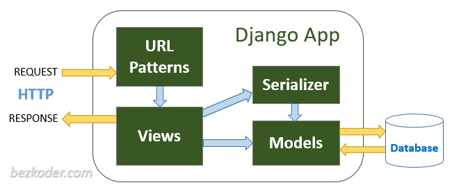

# Smart-Skill

## Project Name
**Smart Skill**

## Platform
**Django**

## Description
Smart-Skill is a web application designed to streamline the process of employee skill management within a company. With a large number of employees, it can be challenging for a company to identify the perfect candidate for a new project. This application aims to solve this problem by providing a platform to store and manage employee skills and skill levels.

## Features
- Store and manage employee skills
- Track skill levels
- Identify suitable candidates for projects
- JWT token-based login system for secure access

## Getting Started

### Prerequisites
- Python 3.10.0
- Django 4.2
- docker (docker-desktop)



### Installation
1. Clone the repository:
    ```bash
    git clone https://github.com/yourusername/smart-skill.git
    ```
2. Navigate to the project directory:
    ```bash
    cd smart-skill
    ```


### Run the Application
Use Docker Compose to run the application:
1. Build and start the containers:
    ```bash
    docker-compose up --build -d
    ```
2. The application will be available at `http://127.0.0.1:8090/`.


### .env file

```
    APP_NAME="Smart Skill"
    APP_DESCRIPTION="This is a web application designed to streamline the process of employee skill management within a company."
    APP_VERSION="1.0.0"


    DATABASE_NAME=postgres
    DATABASE_USER=postgres
    DATABASE_PASSWORD=postgres
    DATABASE_PORT=5432

    EMAIL_HOST_USER = 'your_email@gmail.com'
    EMAIL_HOST_PASSWORD = 'your_password_or_app_password'
    DEFAULT_FROM_EMAIL = 'your_email@gmail.com'
    EMAIL_HOST = "smtp.gmail.com"
    EMAIL_BACKEND = 'django.core.mail.backends.smtp.EmailBackend'
    EMAIL_PORT = 587
    EMAIL_USE_TLS = True

```
#### Create Super User

The superuser has full access to Django’s built-in admin interface, which allows you to manage your application’s data and users easily.

```
    python manage.py createsuperuser

```


# PgAdmin Access and Usage


## Accessing PgAdmin

Once the PgAdmin container is running, you can access it through your web browser:

1. Open your web browser.
2. Navigate to `http://localhost:8054`.


## Logging In

To log in to PgAdmin:

1. On the login page, enter the following credentials:
   - **Email**: `admin@admin.com` (This is the default email. Replace with your configured email if different.)
   - **Password**: `admin` (This is the default password. Replace with your configured password if different.)
2. Click the **Login** button.

## Connecting to a PostgreSQL Database

After logging in to PgAdmin, follow these steps to connect to a PostgreSQL database:

1. In the PgAdmin dashboard, click on **Servers** in the left-hand sidebar.
2. Click the **+** (Add New Server) button or right-click on **Servers** and select **Create** > **Server**.
3. In the **Create - Server** dialog, enter the following details:
   - **General Tab**:
     - **Name**: Enter a name for the connection (e.g., `MyDatabase`).
   - **Connection Tab**:
     - **Host name/address**: Enter the hostname `db`.
     - **Port**: Enter the port number (default is `5432`).
     - **Maintenance database**: Enter the name of the database to connect to `postgres`.
     - **Username**: Enter the PostgreSQL username `postgres`.
     - **Password**: Enter the PostgreSQL password `postgres`.
4. Click **Save**.

Your PostgreSQL database should now be listed under **Servers** in the PgAdmin dashboard. Click on it to manage your database.

## Troubleshooting

- If you cannot access PgAdmin, ensure that the container is running and that there are no firewall rules blocking port `8054`.
- If you cannot log in, verify that the email and password match those specified in your Docker configuration.
- If you encounter issues connecting to your PostgreSQL database, check the connection details (hostname, port, username, password) and ensure that your PostgreSQL server is accessible from PgAdmin.

For additional help, consult the PgAdmin [documentation](https://www.pgadmin.org/docs/).

### Admin Panel

The Admin Panel provides a web-based interface for managing application data. To access it:

1. Open your web browser.
2. Navigate to `http://localhost:8090/admin/`.
3. Log in using the admin credentials set up in your Django settings.

### Schema

The Schema endpoint provides the OpenAPI schema of your API in JSON format. This is useful for integrating with tools that require a formal API description. To access the schema:

1. Open your web browser.
2. Navigate to `http://localhost:8090/schema/`.

### Swagger UI

Swagger UI provides an interactive API documentation interface. It allows you to explore and test API endpoints directly from the browser. To access Swagger UI:

1. Open your web browser.
2. Navigate to `http://localhost:8090/swagger/`.

In Swagger UI, you can view the available API endpoints, see their descriptions, and interact with them by sending requests and viewing responses.

### ReDoc

ReDoc offers a different style of interactive API documentation. It is another way to visualize and interact with your API. To access ReDoc:

1. Open your web browser.
2. Navigate to `http://localhost:8090/api/schema/redoc/`.


## Mock Data Management Command
The load_mock_data management command is a custom Django command designed to load mock data into your database from JSON files. This is useful for populating your database with initial data during development or testing.
### How It Works
Locate the JSON File: The command looks for a mock_data.json file in the specified app directory.

Read the JSON Data: The JSON file should contain data in the following format:

```
     {
        "ModelName": [
            { "field1": "value1", "field2": "value2" },
            ...
        ],
        ...
    }

```

Load Data into Database: The command will create instances of the models specified in the JSON file and populate the database with the provided data.

### Run the Command

Use the load_mock_data command with the --apps option to specify the apps for which you want to load data. You can list multiple apps separated by spaces.

```
     python manage.py load_mock_data --apps app1 app2

```